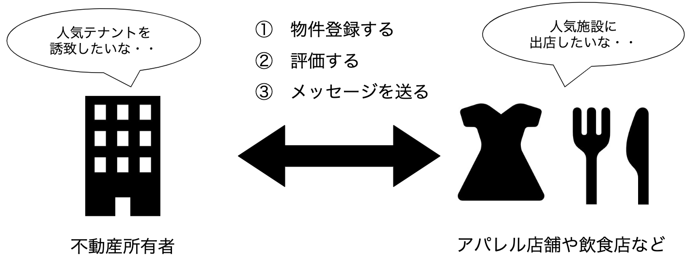
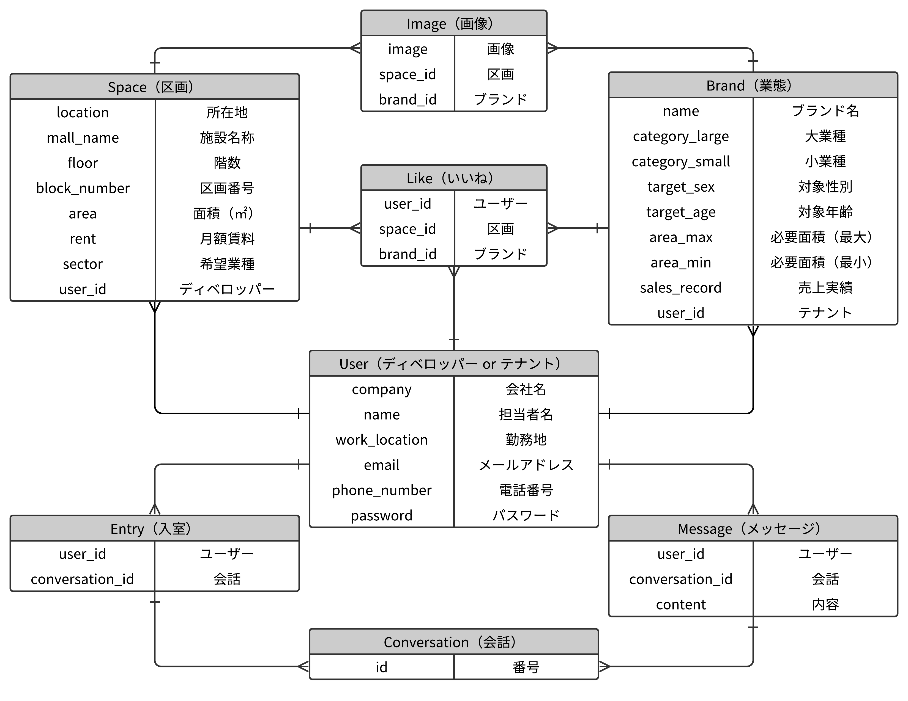

# Malls 
* http://3.114.240.3/

# 使用技術
* HTML（Haml）, CSS（SCSS）, Ruby, Ruby on Rails
  →MLCモデルを活用したアプリを作りたかったため使用。
* JavaScript, jQuery
  →画像投稿時の複数フォーム生成や画像切り替え、スリック表示を非同期で行いたかっため使用。
* MySQL
  →登録情報の入力・出力を容易にするため使用。
* GitHub
  →コード加筆のログを残し、記述ミスが起きた際も容易に修正が可能なため使用。
* AWS（EC2、S3）
  →自作ポートフォリオをデプロイするために使用。（Unicorn, Nginx, Capistranoを併用）
* GoogleAPI
  →不動産情報を地図表示させるために使用。（Google geocodingにより施設名称から座標取得する）

 * イメージ図

 * ER図

# 制作者
* 中島 良
* nov.5x5@gmail.com
* いつでもご連絡ください
 

